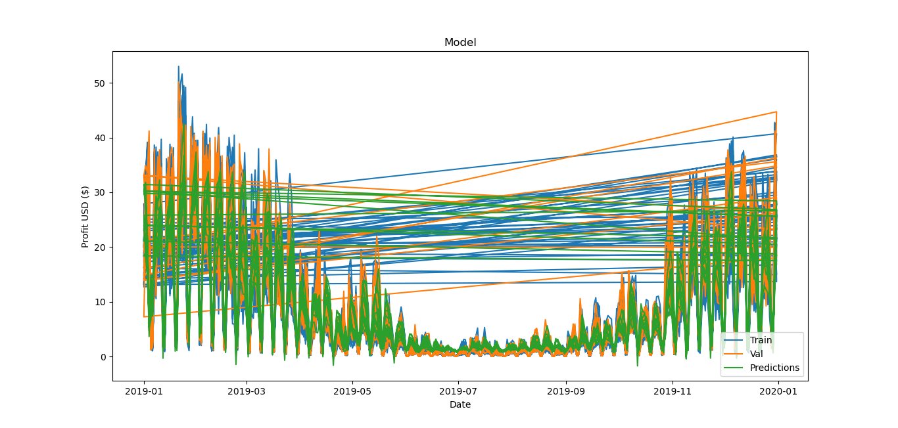

<h1 align="center">A deep learning approach for estimation of price determinants</h1>


<br>


## Introduction
This repository uses recurrent neural networks/lstm to predict the price of 55 market currencies using **keras** library.

## Getting Started
to use this repository, install required packages
1. Python 3.7
2. keras==2.2.4
3. sklearn==0.20.2
4. numpy==1.16.2
5. pandas==0.23.4
6. matplotlib==2.2.3

using the following command:
```
pip3 install -r requirements.txt
```
### **Example**
```python
from keras.layers import GRU, LSTM, CuDNNLSTM
from price_prediction import PricePrediction

ticker = "USD"

# init class, choose as much parameters as you want, check its docstring
p = PricePrediction("USD", epochs=1000, cell=LSTM, n_layers=3, units=256, loss="mae", optimizer="adam")

# train the model if not trained yet
p.train()
# predict the next price for profit
p.predict()

# print some metrics
print("Mean Absolute Error:", p.get_MAE())
print("Mean Squared Error:", p.get_MSE())
print(f"Accuracy: {p.get_accuracy()*100:.3f}%")

# plot actual prices vs predicted prices
p.plot_test_set()
```
### Output
```
Mean Absolute Error: 145.36850360261292
Mean Squared Error: 40611.868264624296
Accuracy: 63.655%
```


<hr>

# <a name='Installation guide'></a>Installation guide

Next

```bash
git clone https://github.com/Abel-Blue/pricing-model.git
cd pricing-model
sudo python3 setup.py install
python scripts/test.py
```
## Next Steps
- Fine tune model parameters ( `n_layers`, RNN `cell`, number of `units`, etc.)
- Tune training parameters ( `batch_size`, `optimizer`, etc. )